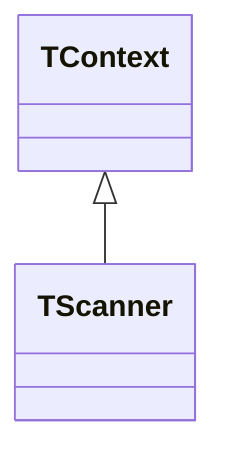
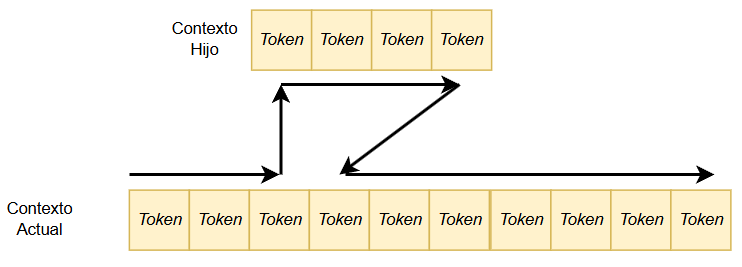

# alexia_lib
Pascal library that includes a lexical analyzer for creating compilers.

# 1. Descripción

Alexia es una librería de clases en el dialecto de Free Pascal, que sirve como apoyo primario en la creación de compiladores o intérpretes.

Incluye la definición de diferentes clases que, entre otras facilidades, permite crear los siguientes elementos:

* Explorador de texto
* Analizador léxico (lexer).
* Gestor de mensajes.

Inicialmente, esta librería estaba incluida en el compilador P65Pas, pero se ha separado, para manejarse como una librería independiente y reutilizable en otros proyectos.

El analizador léxico está definido inicialmente para reconocer el lenguaje Pascal, pero puede ser configurado para manejar lenguajes diferentes. La definición de un nuevo lenguaje se hace por código. No tiee soporte para expresiones regulares.

Características:

* Es una librería ligera, que se compone de una sola unidad de Pascal.
* Está diseñada para una exploración rápida del código fuente. 
* Permite configurar (por código) el lenguaje que se va a analizar.
* Permite navegación y retorno seguro para explorar archivos secundarios desde el archivo principal.
* Incluye funciones para guardar y restaurar el estado del lexer durante la exploración.
* Incluye una clase adicional para la gestión de mensajes desde el lexer o desde el compilador.
* Ofrece una jerarquía de clases que permite usar las funciones más básicas de exploración de texto o las más avanzadas de un analizador léxico.

## 1.1 Uso de la librería

Para el uso de la librería solo se debe incluir la unidad "alexiaLex" en la sección uses del proyecto:

``` Pascal
uses
  Classes, SysUtils, Types, ... , alexiaLex;
```

## 1.2 Creación de un Explorador de texto

Un explorador simple de texto se puede construir con una instancia de la clase *TScanner*:

``` Pascal
uses Classes, SysUtils, alexiaLex;
var
  scanner: TScanner;
  textLines: TSTringList;
begin
  scanner := TScanner.Create;
  textLines := TSTringList.Create;
  textLines.Text := 'Hello world';
  scanner.SetText(textLines);
  scanner.nlin := 1;
  scanner.setRow(1);
  scanner.setCol(1);
  while not scanner.EOF do begin
    writeln(scanner.ReadChar);
    scanner.NextChar;
  end;
  readln;
  textLines.Destroy;
  scanner.Destroy;
end.
```
La exploración del texto se realiza caracter por caracter, sin reconocimiento de tokens.

El trabajo de este explorador de texto es limitado y constituye solo la base para el trabajo de la clase derivada *TContext*.

## 1.3 Creación de un Analizador léxico

Un analizador léxico funcional se implementa en la clase *TContext* que hereda de la clase *TScanner*, una clase que implementa a un simple explorador de texto que solo se mueve carácter por carácter.

En cuanto a la estructura del lexer se puede decir que se compone de una clase base *TScanner* y una clase derivada *TContext*.


El siguiente ejemplo extrae los tokens de una cadena usando una instancia de TContext:

``` Pascal
uses Classes, alexiaLex;
var
  lexer: TContext;
begin
  lexer := TContext.Create;
  lexer.SetSource('Hello World.');  //Set source and scan the first token.
  while true do
  begin
    writeln(lexer.ReadToken); //Read the current token (the last scanned).
    if lexer.EOF then break;  //Check the lexer state, not the current token.
    lexer.Next;
  end;
  readln;
  lexer.Destroy;
end.
```
A diferencia de *TScanner*, *TContext* hace reconocimiento de tokens y del tipo de token (Campo TContext.tokType) en una sintaxis de Pascal. El cambio de sintaxis para otros lenguajes se explica en la sección 2.3.

Para manejar un analizador léxico con capacidades de recorrer múltiples archivos, se debe usar la clase *TAleLexer*.

## 1.4 Creación de un Gestor de mensajes

Para crear un gestor de mensajes se debe crear una instancia de la clase *TMessageManager*.

Un gestor de mensajes permite se usa para administrar los mensajes de advertencia o de error que puede generar un compilador.

El objetivo es que en la implementación de un compilador, no se generen los mensajes directamente al aplicativo, sino al gestor de mensajes. De modo que luego este gestor de mensajes pueda conectarse con el aplicativo. Esta arquitectura permite eliminar la dependencia entre aplicativo y compilador y facilita la integración del compilador con diversos aplicativos (de consola o con GUI).

## 2. Clases

### 2.1	La clase TScanner

*TScanner* solo implementa las funcionalidades básicas de un analizador léxico, como es la exploración carácter por carácter y las funciones NextChar() y ReadChar(), además de las funciones para detectar el estado del cursor (BOF, EOF, EOL). Se podría decir que *TScanner* es un lexer elemental que no está definido para ningún lenguaje en particular, sino que podría servir de base para crea analizadores orientados a un lenguaje en particular, como lo hace *TContext*.

En cuanto a almacenamiento del texto fuente, *TScanner* no dispone de contenedores disponibles. Solo se incluye una referencia a un TStrings y una función para asignar esta referencia:

``` Pascal
  TScanner = class
    ...
    //Information of the source text.
    curLines : TStrings;   //Reference to the current StringList, used to scan. 
    ...
    procedure SetText(strList: TStringList);  //Sets the source text.
  end;
```
La implementación de *TScanner* se ha hecho considerando la velocidad como factor más importante. Es por eso que, varias de sus funciones de tipo INLINE, además de ofrecer las versiones “rápidas” de la clase que contienen menos comprobaciones y/o son INLINE.

Sin embargo, *TScanner* no ofrece gran utilidad para una exploración real del código fuente, porque solo realizar exploración carácter por carácter y no identifica tokens en sí. Por eso no existe una función como ReadToken. Lo más cercano sería la función ReadChar():

``` Pascal
  TScanner = class
    ...
  public  //Scan functions
    procedure NextChar;        //Move cursor to the next position
    function ReadChar: char; inline;  //Returns the char pointed by cursor
    procedure SetText(strList: TStringList);  //Sets the source text.
  end;
```

El funcionamiento de *TScanner* es simple. Después de inicializar la referencia “curLines” con SetText(), se debe iniciar el cursor “frow, fcol” con las coordenadas iniciales del texto (1,1). Luego, para leer el carácter actual, se usa ReadChar() y para pasar al siguiente carácter se usa NextChar(). Al llegar al fin de la línea, NextChar() pasa a explorar la siguiente línea.

Para detectar el estado del “lexer", se usa algunas de las funciones de estado de *TScanner*:

``` Pascal
  TScanner = class
    ...
  public  //Check positions
    function Empty: boolean; inline;  
    function Bol: boolean;  
    function Eol: boolean; 
    function FirstLine: boolean;
    function LastLine: boolean;
    function Bof: boolean; inline; 
    function Eof: boolean; inline;
    ...
  end;
```

Para completar la funcionalidad de *TScanner* se usa una clase derivada llamada *TContext*. El nombre *TContext* se mantiene desde las primeras versiones en donde diseñé un analizador léxico que manejara diversos archivos fuente y considerara a cada fuente de datos como un “contexto” diferente, es decir, una entidad con información adicional sobre su contenido o posición.

### 2.2	La clase TContext

Precisamente la clase *TContext* complementa la funcionalidad de “TScanner” de la siguiente forma:

* Incluye un contenedor de texto para la exploración.
* Incluye funciones de mayor nivel de exploración.
* Reconoce la sintaxis (a nivel léxico) de Pascal.
* Contiene funciones para guardar el estado de la exploración.

Además de estas facilidades, *TContext* incluye diversas formas de definir la fuente de texto. Estas están implementadas en las funciones SetSource() y SetSourceF():

``` Pascal
  TContext = class(TScanner)
    ...
    //Fija el contenido del contexto con cadena
    procedure SetSource(txt : string);   
    //Fija contenido a partir de una lista
    procedure SetSource(lins: Tstrings; MakeCopy: boolean = false); 
    //Fija el contenido del contexto con archivo
    procedure SetSourceF(file0: string);  
    ...
  end;
```
Una de las características de *TContext*, es que maneja ya un lenguaje a nivel léxico. Es decir, que puede reconocer los elementos léxicos (tokens) de un lenguaje, que en este caso es Pascal. Para ello se ha definido un tipo enumerado con todos los tipos de token que se necesitan en este compilador:

``` Pascal
  TTokenKind = (
    //Pascal Lexer token
    tkNull     ,  //Not defined token. Single-line token.
    tkEol      ,  //End of line. Single-line token.
    tkSymbol   ,  //Symbol
    tkSpace    ,  //Space token. Consider only characters #9 and #32. 
    tkIdentifier, //Identifier. Single-line token.
    tkLitNumber,  //Literal number
    tkString   ,  //Literal String
    tkComment  ,  //Comment. Multi-line token.
    tkOperator ,  //Operators
    tkDirective,  //Directiva
    tkExpDelim ,  //Delimitador de expresión
    tkBlkDelim ,  //Delimitador de bloque
    tkChar     ,  //
    tkKeyword  ,  //Reserved words
    tkDirDelim ,  //Delimitador de directiva. Usado solo para directivas.
    tkOthers      //Otros
  );
```

La funcionalidad de poder reconocer a los tokens de Pascal, se puede apreciar en el método TContext.DecodeNext(), que es llamado por TContext.Next(), por cada token que se necesita explorar. 

Para apoyar el reconocimiento de tokens, se define dentro de *TContext* dos atributos de posición, adicionales a los que define *TScanner*: 

``` Pascal
  TContext = class(TScanner)
  public  //State of the scanner
    //Position for start of current token
    row0     : integer;    //From 1 to "nlin". 
    col0     : integer;    //From 1 to "curSize". 
    ...
  end;
``` 

Estos atributos vendrían a indicar la posición, dentro del texto fuente, del inicio del token actual, mientras que los atributos TScanner.frow y TScanner.fcol vendrían a ser la posición del siguiente token.

Para leer los valores entre (ro0, col0) y (frow, fcol) se hace uso del método ReadToken().  Para avanzar al siguiente token, se hace uso de Next().

### 2.2.1	Cambio de sintaxis 

El reconocimiento de tokens en TContext se realiza en TContext.DecodeNext(), pero, como este método conoce solo los tokens de Pascal, se podría pensar que TContext solo reconoce a Pascal como lenguaje fuente (salvo otros lenguajes que se podrían tolerar por similitud en los tokens), pero TContext incluye un  “callback” llamado *OnDecodeNext*.

Mediante el uso del evento *OnDecodeNext*, se puede enchufar una función que haga un reconocimiento diferente de tokens, de forma que se podría dar soporte a otro lenguaje de programación.

Para configurar una nueva sintaxis, se debe definir una rutina de reconocimiento en el campo *OnDecodeNext*:

``` Pascal
  lexer.OnDecodeNext := @DecodeNext;
```
La estructura de DecodeNext() debe ser similar a la de TContext.DecodeNext().

*TContext* nos ofrece todo lo que podemos necesitar para explorar un archivo o texto fuente, usando el lenguaje predefinido o alguno personalizado, además de manejar bien la asignación del texto fuente, y tener todas las funciones necesarias para la exploración y reconocimiento de tokens. Sin embargo, *TContext* carece de una funcionalidad importante que requieren algunos compiladores, y es la capacidad para poder manejar diversos archivos fuente y poder moverse libremente entre ellos.

Esta funcionalidad se incluye en la clase derivada *TAleLexer*.

### 2.3 La clase TAleLexer

La clase TAleLexer representa a un lexer con capacidades de manejar múltiples códigos fuente. Estos códigos fuente pueden ser archivos o simples cadenas de texto.

```mermaid
classDiagram
    direction LR
    
    class TAleLexer {
        +ctxList: List~TContext~ 
        +curCtx: TContext
        +AddContext()
        +ClearContexts()
    }
    
    class TContext {
        +tokType  : TTokenKind
        +Next() 
        +ReadToken()
    }
    class TScanner {
        +frow: integer
        +fcol: integer
        +NextChar()
        +Eol()
    }
   
    TAleLexer "1" *-- "0..*" TContext : agregación 
    TContext <|-- TScanner : herencia
  ```

TAleLexer  tiene la capacidad de explorar texto desde diversos archivos fuente, usando una instancia de TContext para cada uno de ellos.

#### 2.3.1	Exploración de texto

La exploración de un código fuente desde TAleLexer se hace de forma similar a como se haría TContext, con la salvedad de que TAleLexer es un analizador léxico multicontexto. 

Para iniciar la exploración se debe crear primero el contexto principal, usando alguna de las funciones de creación de contextos:

``` Pascal
  TAleLexer = class
    ...
  protected  //Context manage
    ctxList: TContextList;   //Lista de contextos de entrada
    function AddContext: TContext;
    procedure NewContextFromText(txt: string; fileSrc: String);
    procedure NewContextFromFile(filSrc: String; out notFound: boolean);
    procedure NewContextFromTStrings(lins: Tstrings; filSrc: String);
    ...
  end;
``` 

Una vez creado un contexto, este pasa a ser el contexto activo, sobre el cual se realizan las acciones de exploración, de las cuales, la función principal es el método TAleLexer.Next(), que funciona de forma similar a TContext.Next() pero que trabaja sobre el contexto activo y puede realizar un cambio de contexto de forma transparente (Ver sección 2.3.2).

Otras funciones de exploración son las que se muestran en el siguiente fragmento de la declaración de TAleLexer:

``` Pascal
  TAleLexer = class
    ...
  public //Scan functions
    token    : string;     //Current Token
    tokType  : TTokenKind; //Current Token type
    function atEol: Boolean; inline;
    function atEof: Boolean;
    procedure SkipWhites;
    procedure SkipWhitesNoEOL;
    procedure Next;       //Go to the next token.
    procedure GotoEOL;    //Go to the EOL position.
    ...
  end;
``` 

El método TAleLexer.SkipWhites() tiene también la capacidad de moverse entre contextos como lo hace TAleLexer.Next().

Los atributos “token” and “tokType” constituyen una diferencia con respecto a TContext. Estos atributos almacenan información actualizada con respecto al token actual y se actualizan con cada llamada a Next() o a SkipWhites() o a SkipWHitesNoEOL(). 

El atributo “token” almacena el texto del token actual y el atributo “tokType” almacena el tipo de token actual. Estos atributos se mantienen en variables para poder leerlas en cualquier momento sin pérdida de eficiencia, a diferencia de TContext, que requiere llamar a TContext.ReadToken() para obtener el token apuntado actualmente.

#### 2.3.2	Exploración de múltiples contextos

La necesidad de explorar archivos, adicionales al archivo principal, es necesario en muchos lenguajes de programación. Específicamente en Pascal, se justifica en dos casos:

*	Cuando se exploran unidades en una sentencia USES
*	Cuando se ejecuta la directiva {$INCLUDE …}

El contenedor de contextos en TAleLexer es “ctxList”:

``` Pascal
  TAleLexer = class
    ...
  public     //Information for current context
    curCtx : TContext;       //Referencia al contexto de entrada actual
    ...
  protected  //Context manage
    ctxList: TContextList;   //Lista de contextos de entrada
    ...
  end;
``` 

“TContextList” es una lista genérica de la clase “TContext”:

``` Pascal
  TContextList = specialize TFPGObjectList<TContext>;
``` 

La exploración del archivo principal se hace creando un contexto inicial (TContext), y, cada vez que se necesita explorar un archivo diferente, se crea un contexto nuevo.

Los métodos para crear contextos nuevos son los mismos que se usan para crear el contexto principal:

``` Pascal
  TAleLexer = class
    ...
  protected  //Context manage
    ctxList: TContextList;   //Lista de contextos de entrada
    function AddContext: TContext;
    procedure NewContextFromText(txt: string; fileSrc: String);
    procedure NewContextFromFile(filSrc: String; out notFound: boolean);
    procedure NewContextFromTStrings(lins: Tstrings; filSrc: String);
    procedure ReturnToPrevContext;
    ...
  end;
``` 

Los contextos creados se identifican por su ID, que es un número entero que indica también su posición dentro de la lista *ctxList*, de modo que su ubicación sea directa. Este proceso se aprecia en TAleLexer.AddContext():

``` Pascal
function TAleLexer.AddContext: TContext;
begin
  inherited;
  Result := TContext.Create;  //Creates Context.
  Result.retPos := GetCtxState; //Keep return position.
  Result.onGenError := @GenError;
  ctxList.Add(Result);        //Register Context.
  idCount := ctxList.Count-1; //Calculate the index.
  Result.idCtx := idCount;    //Set reference to index.
end;
``` 

El proceso de moverse entre contextos, en medio de una exploración, es la facilidad que nos ofrece “TAleLexer” y en resumen, consiste en que se puede abrir otro contexto (hijo), en medio de una exploración, para pasar a explorarlo y retornar luego al contexto inicial al terminar la exploración. Este proceso se aprecia en la siguiente figura:



Para que el contexto hijo sepa a donde retornar al terminar la exploración, se hace uso del atributo “retPos”:

``` Pascal
  TContext = class(TScanner)
    ...
  public
    idCtx    : integer;     //Unique identifier for the context.
    retPos   : TAleLexertate;  //Return position to parent context.
    ...
  end;
``` 

Este atributo se inicializa cuando se llama a TAleLexer.AddContext() y se usa para restaurar el estado del contexto actual en TAleLexer.ReturnToPrevContext().

El retorno al contexto padre, al terminar la exploración de un contexto hijo, no es automático por defecto. Debe activarse a través del atributo “autoReturn”:

``` Pascal
  TContext = class(TScanner)
    ...
  public
    autoReturn: boolean;    
    autoRemove: boolean;    
    ...
  end;
``` 

Cuando se pone “autoReturn” a TRUE, es cuando se habilita la recuperación del contexto anterior, así como su estado, al terminar la exploración de un contexto hijo. Si no se activara “autoReturn”, al terminar la exploración del contexto hijo (condición EOF) ya no se podría leer más tokens, y es casi seguro que la compilación terminara con el error “Unexpected End of file”.

El proceso de retomar el contexto padre se puede apreciar en TAleLexer.SkipWhites() y en TAleLexer.Next().

La bandera “autoRemove” complementa la función de “autoReturn” y permite adicionalmente a la función de autoretorno, eliminar el contexto hijo. Sin embargo, no se recomienda usar esta característica (a pesar de que optimizaría el uso de la memoria) si el programa o compilador necesita retroceder en la exploración hacia alguna posición que pudiera existir en otro contexto y este debe estar abierto o se generaría un error.

#### 2.3.3	Posición en un contexto

Para guardar la información de una posición específica dentro de alguno de los códigos fuente, se usa el objeto TSrcPos:

``` Pascal
  TSrcPos = object
    //Id for the context. Through this reference we can obtain information about the file.
    idCtx  : integer;
    //Attributes for position.
    row    : integer;  //Row number
    col    : integer;  //Column number
    function RowColString: string;
    function EqualTo(const target: TSrcPos): boolean;
  end;
```
La clase *TAleLexer* incluye métodos para lectura y escritura de la posición del lexer:

``` Pascal
  TAleLexer = class
    ...
    //Control for position
    function GetSrcPos: TSrcPos; inline;
    procedure SetSrcPos(const srcPos: TSrcPos);
    ...
  end;
``` 
El objeto *TSrcPos*, sin embargo, solo guarda información de posición, mas no del estado del lexer. Eso significa que si se guarda la posición en un "TSrcPos" (con GetSrcPos), y luego se restaura (con SetSrcPos) después de hacer exploraciones adicionales, el lexer no volvera al estado que tenía cuando exploraba la posición guardada.

EL objeto TSrcPos se debe ver como una forma rápida de guardar solo información de posición dentro del código fuente. Es por eso que se define como objeto estático (no como clase) y con pocos campos.

Para guardar posición y estado (y así poder retomar una exploración previa, en las mismas condiciones), existe el objeto *TContextState*. 

#### 2.3.4	Estado de un contexto

Como en el diseño de TAleLexer se considera la posibilidad de moverse libremente entre contextos, se hace necesario guardar el estado de un contexto antes de hacer el cambio y retornar ese estado al retornar al contexto previo.

Para almacenar el estado de un contexto se ha creado el registro TAleLexertate:

  TAleLexertate = record
    idCtx   : integer;     //Id for the context.
    //Attributes of TScannerState
    frow    : integer;
    fcol    : integer;
    curLine : string;
    curSize : integer;
    //Additional atributes.
    row0    : integer;
    col0    : integer;
    tokType : TTokenKind;
    tokPrec : integer;
    tokPrecU: integer;    //Precedence when "tokType" is "tkOperator" and operator can be used as unary operator.
  end;

Esta información relativa a un contexto es todo lo que se necesita para poder suspender una exploración, pasar a explorar otro contexto (o el mismo en otra ubicación) y poder retornar luego, de forma segura, al contexto inicial.

La clase *TAleLexer* incluye métodos para lectura y escritura del estado del lexer:

``` Pascal
  TAleLexer = class
    ...
    //Control for state
    function GetCtxState: TContextState;
    procedure SetCtxState(pc: TContextState);
    ...
  end;
``` 
Dentro de la misma clase *TContext*, también existen funciones que permiten realizar el movimiento seguro entre contextos:

``` Pascal
  TContext = class(TScanner)
    ...
  public  //Control for current position
    procedure GetContextState(out c: TContextState);
    procedure SetContextState(const c: TContextState);
    procedure SaveContextState;    //Guarda el estado actual del lexer
    procedure RestoreContextState; //Restaura el estado actual del lexer
    //Current cursor position.
    property row: integer read frow;
    property col: integer read fcol;
    ...
  end;
``` 
SaveContextState() y RestoreContextState() permiten implementar la misma funcionalidad que harían GetContextState() y SetContextState() sin necesidad de usar una variable TContextState, pero con la desventaja de que no soportarían anidamiento.

#### 2.3.5	Apertura eficiente de contextos 

Por lo general, todos los contextos que usa *TAleLexer* se leen a partir de un archivo de texto y la carga de ese contexto nuevo en el contenedor *ctxList* implicaría leer ese archivo fuente desde disco usando TAleLexer.NewContextFromFile(). 

Pero como *TAleLexer* ha sido diseñado para ser utilizado también dentro de una IDE, en donde los archivos fuente pueden estar cargados en un editor de la IDE, se puede lograr un nivel de optimización adicional, evitando acceder al archivo desde disco, si la IDE lo tiene ya cargado.

En esta forma de trabajo, *TAleLexer* puede leer el código fuente directamente desde memoria, a través de un objeto TStringList.

Para habilitar esta facilidad, se debe implementar el evento *OnRequireFileString* que es llamado cada vez que el lexer requiere cargar un archivo desde disco. Dentro del manejador del evento se puede verificar si el archivo solicitado se tiene ya cargado en memoria, y, de ser así, se le pasa el acceso a través de un TStringList.
